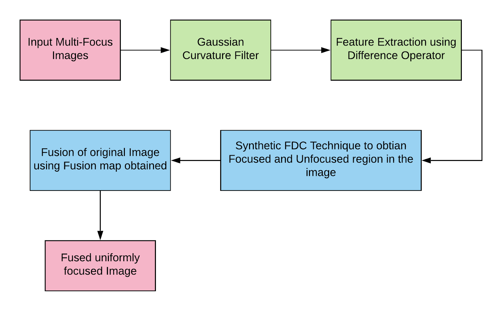
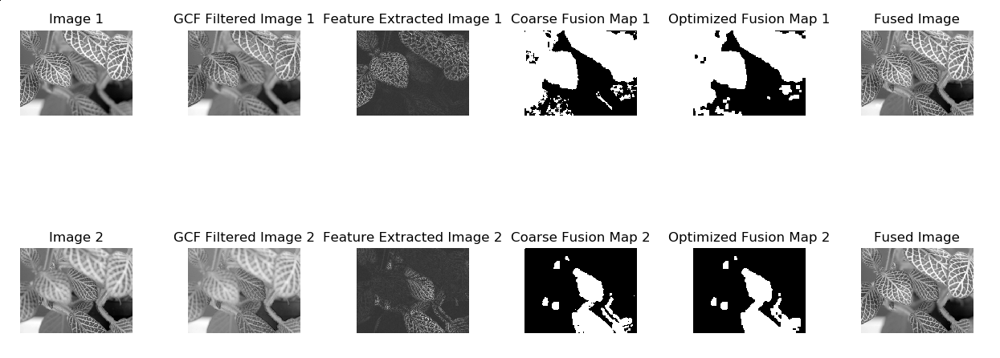

# Multi-Focus Image Fusion via GCF

The main objective which is to realize a system to convert a set of multi-focused images to a clear image is achieved by using a GCF and a synthetic FDC(Focusing Degree Criterion). The algorithm for the same includes the following steps:

- Feature Extraction (using Gaussian Curvature Filter)
- Focusing Degree Confirmation (using Spatial Frequency and Local Variance)
- Filtering Coarse fusion map
- Image Fusion

### Usage

```
usage: fusion.py [-h] [--image1path IMAGE1PATH] [--image2path IMAGE2PATH]
                 [--color COLOR] [-m M] [-n N] [-p P] [-q Q]
                 [--outputdir OUTPUTDIR]
arguments:
  -h, --help            show this help message and exit
  --image1path IMAGE1PATH
                        Path to the Image 1.
  --image2path IMAGE2PATH
                        Path to the Image 2.
  --color COLOR         Whether the image is colored or not
  -m M                  no. of times gaussian curvature filter is applied
  -n N                  dialation and erosion kernel size
  -p P                  pxq dimension of patch in focus region
  -q Q                  pxq dimension of patch in focus region
  --outputdir OUTPUTDIR
                        Directory in which output needs to be stored
```
### Image Fusion Pipeline


### Result


